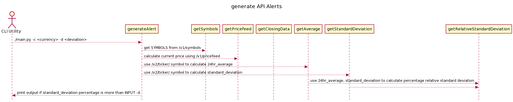

# Introduction

Simple python CLI to Implement monitoring alerts using Gemini public API

## Table of Contents

- [pre-requisites](#pre-requisites)
- [Command to run CLI](#command-to-run-cli)
- [JSON formatted log line details](#json-formatted-log-line-details)
- [Sequence Diagram](#sequence-diagram)
- [Roadmap](#roadmap)

## pre-requisites
- jq needs to be installed
- docker client needs to be installed

## Command to run CLI

```
$ ./main.py -h
2019-08-05 16:10:51,143 - AlertingTool - INFO - Parsing args
usage: apiAlerts.py [-h] [-c CURRENCY] [-d DEVIATION]
 
Runs checks on API
 
optional arguments:
  -h, --help            show this help message and exit
  -c CURRENCY, --currency CURRENCY
                        The currency trading pair, or ALL
  -d DEVIATION, --deviation DEVIATION
                        percentage threshold for deviation
```
```
$ ./main.py -c btcusd -d 1
{
  "timestamp": "2021-11-15T18:25:43.511Z",
  "level": "INFO",
  "trading_pair": "btcusd",
  "deviation": true,
  "data": {
    "last_price": "64381.98",
    "average": "65196.09",
    "change": "765.67",
    "sdev": "1.2"
  }
}
```

```
$ ./main.py -c ethusd -d 1
{
  "timestamp": "2021-11-15T18:25:43.511Z",
  "level": "INFO",
  "trading_pair": "ethusd",
  "deviation": true,
  "data": {
    "last_price": "4607.69",
    "average": "4661.36",
    "change": "53.67",
    "sdev": "1.1"
  }
}
```

## JSON formatted log line details

```
Timestamp in ISO8601 format (2006-31-10T15:00:00-0500)

Log level - (ie. INFO for regular output. ERROR for upstream errors, and logical/math errors, DEBUG for extra data that is not required for user consumption)

Trading Pair: BTCUSD/ETHUSD/BTCETH/etc.

Deviation: true/false boolean indicating if there is a price deviation or not

Data: additional data regarding the log, i.e. if there was an upstream ERROR, what it was, or if there was a price deviation, what the details of that deviation were

Last Price: a float object that indicates what the last price was

Average Price: average price over the requested time period

Deviation percentage: a float object that indicates the deviation as a percentage

Price change value: a float that object that indicates the deviation as a notional value
```

## Sequence Diagram



## Roadmap
- Add Github Actions to publish to DockerHub/Artifactory
- Add Unit Tests
- Implement functionality to add releases and tags
- Add functionality to package it as standalone package
- Add Makefile to perform local actions
- Create Infrastructure stack to deploy this application to Local Kind Cluster
